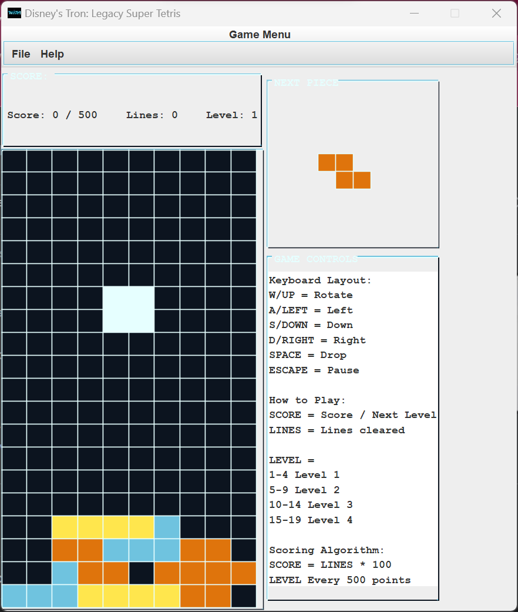

# legacy-tetris

---

# Project Name: Legacy Tetris

## Description
Early Java game development project based on the Disney remake of Tron: Legacy theme.


## Table of Contents (Optional)

- [Installation](#installation)
- [Usage](#usage)
- [Contributing](#contributing)
- [Credits](#credits)
- [License](#license)

## Installation
Check Java Version

```bash
java -version
```
```plaintext
java version "17.0.1" 2021-10-19 LTS
Java(TM) SE Runtime Environment (build 17.0.1+12-LTS-39)
Java HotSpot(TM) 64-Bit Server VM (build 17.0.1+12-LTS-39, mixed mode, sharing)
```
Clone GitHub Repository

```bash
git clone https://github.com/your-username/tetris-clone.git
cd tetris-clone
# further installation steps
```

## Usage

Method 1: Run from Java IDE

```bash
# Import project and open source folder src/
# Run TetrisMain.java
```

Method 2: Run Java Compiler from command line

```bash
# Open a command prompt or terminal.
# Navigate to the directory 'src/view/' and type:

javac TetrisMain.java
java TetrisMain

```

## Screenshots or Video


## Contributing
No contributions at this time.

## Credits
Many thanks to TCSS 305 Instructors for providing source code, Disney's Tron: Legacy for concept art and design, colourlovers.com artists for creating the color scheme.

## License
This project is currently unlicensed. All rights reserved. This means you have no permissions to use, modify, or distribute the code in this repository until a license is designated.

## Contact Information
- Email: ddxbugs@proton.me

## Additional Sections (Optional)
- **Background**: Project assignment
- **Technologies Used**: Swing Java
- **Challenges and Learnings**: Observer Pattern

---
